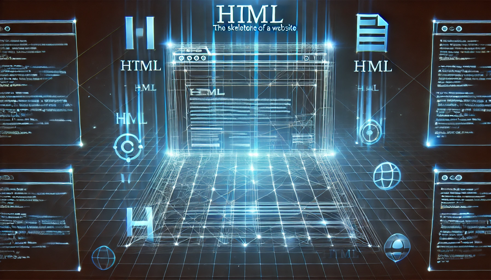
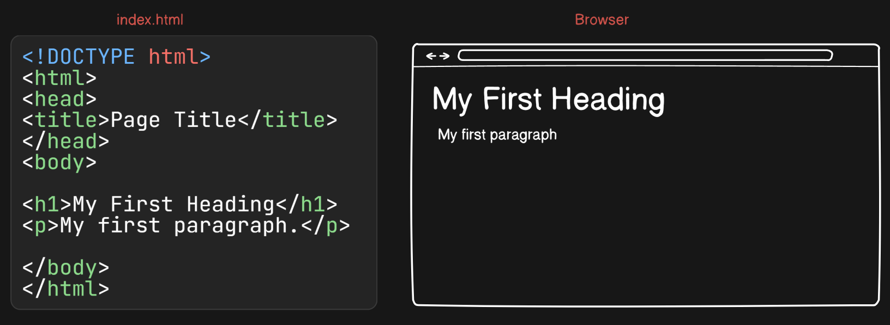
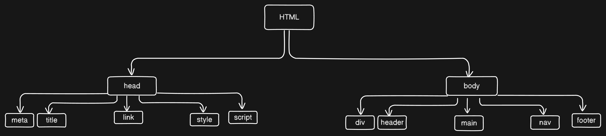

# HTML Basics: A Beginner's Guide to Building Webpages

> ### Let us learn about skeleton of Web Pages

- Before diving into HTML, here's a question for you:

> Why is HTML known as the skeleton of the web?

- Think about a building. To construct it, we need columns and pillars. To make these, we need an iron rod structure, which is like the HTML of a web page.

- Another example: Consider a human body. If you remove all the skin, flesh, and blood, what remains is the bone structure, known as the skeleton.

## HTML:-

We can understand HTML by asking three questions: What, Why, How

Let us elaborate.

## What is HTML :-

- HTML stands for Hyper Text Markup Language

- HTML is not a programming language, it is a markup language for creating web pages.

- HTML elements tell the browser how to display the content.

- There are many elements in HTML, such as h1, h2, p, div, span, and img.

- Some of these elements are semantic, while others are non-semantic.

### What is semantic and what is non-semantic elements in HTML ?

> Yad rakhlo ji ye to interview ka sawaal hai,
> Semantic elements provide meaning to the content. Examples: `<header>`, `<footer>`, `<section>`.

---

> Non semantic elements are opposite of Semantic, which has no proper meaning like `<h1>`, `<p>`, `<div>`, `<span>`

- We discuss further about HTML elements and attributes later.

## Why HTML :-

- We need HTML because, without it, we cannot design web pages. Just like a skeleton is essential for a human or any animal to exist, HTML is essential for web pages.

- HTML describes web pages.

- HTML consists of a series of elements.

- HTML elements tell the browser how to display the content.

---

## How to write code of HTML ? :-

- For HTML, we first need a code editor like VS Code, Atom, or another option. There are many code editors available online, so choose the one you prefer.

- Second, we need a browser like Chrome, Safari, or Mozilla. Choose the one you prefer.



- First, create a folder and make a file named index.html.

- Open the folder in your code editor. For my case it is VS Code.

- Install the necessary extensions. For HTML, we need a live server extension (in VS Code) to view changes in the browser as we make them in the code editor.

- Now your system is ready to write HTML.

> Why so many developers use index as file name of .html file ?
>
> > rakhne ko aap kuchh bhi rakh sakte ho lekin index.html kyun. kyunki kuchh browser ka yeh default entry point hota hai.

```html
<!DOCTYPE html>
<html lang="en">
  <head>
    <meta charset="UTF-8" />
    <meta name="viewport" content="width=device-width, initial-scale=1.0" />
    <title>Document</title>
  </head>
  <body>
    <h1>Hello guysss</h1>
  </body>
</html>
```

`<!DOCTYPE html>`:-

- It declares the document type is HTML.

- DOCTYPE means document type.

- It ensures the browser recognizes it as an HTML document and prevents unexpected behavior. The browser has default behavior, which we will learn about in the JavaScript module.

`<html lang = ”en”>`:-

- It tells browser about the primary language of the code. Here primary language is english.

- We can pass other language as primary language.

`<head>` :-

- The head section starts here. You can think of it like our own head, which has many parts like hair, eyes, ears, and nose. Similarly, the HTML head section contains meta tags, the document title, links for adding external CSS, fonts, and a favicon (wo jo website ka name ke sath chhota sa dikh ta hai left side mai).

- For internal styling, we can use the style tag in the head section.

- For JavaScript, we can also use the script tag. JavaScript can be written in the head section, and there are some pros and cons to doing this, which we will learn about in the JavaScript module.

`<meta charset = “UTF-8“>` :-

- UTF stands for Unicode Transformation Format

- It specifies that it supports all the symbols and characters present in world wide.

- There are other UTF also.

`<meta name= “viewport“ content=”width=device-width", initial-scale=1.0”>`:-

- Sets viewport according to the device width and initial zoom level.

- It is important because there are different size of screen sizes, Example:- Mobile, Laptop, Tablet, Monitor screen

`<title>Document</title>` :-

- Default title is document because it is a document type (we learn in DOCTYPE html).

`<title>` :-

- Element tags start with an angular bracket, followed by the type of element, and end with a closing angular bracket.

- Then, the name of the document is given.

`</ title>` :-

- Close the element tags with the same angular brackets, but here we use a forward slash before the element name.

`</ head>` :-

- The head section closes here.

`<body>` :-

- Body section starts here.

`<h1>Hello Guyss</h1>` :-

- The h1 tag starts here, followed by the h1 content, and then the h1 tag is closed.

`</ body>` :-

- Body tag closed here

`</html>` :-

- html ends here

> The HTML tree diagram is shown below.
> 

Let us understand some terms here.

### 1. Elements:-

- HTML elements start at the start and go to the end.

- example:- `<h1>Priyansu</h1>`

- The yellow mark is a element of html which contains starting of h1 tag, content of h1 tag and ending of h1 tag.

### 2. Tags :-

- Tag is the syntax used to define the start or end of an element.

- There are two types of tags:

### 3. Paired tag:

- This has both an opening and a closing bracket.

- Example: h1 —> `<h1>Priyansu</h1>`

### 4. Self-closing tag:

- This does not have a closing bracket.

- Example:- `<br>` → break line

- There are so many tags in html. You can’t memorize everything.

### 5. Attributes:-

- HTML attributes provide extra information about HTML elements.

- Example: 

- Here, src is an attribute of the img tag.

### 6. Comments :-

- Comments are not rendering to the browser.

- Example:- `<!-- This is a comment -->`

### 7. Headings :-

- There are 6 types of headings in HTML, from h1 to h6. h1 is the largest, and h6 is the smallest, but we can control their size using CSS.

---

That's all about the basics of HTML...
