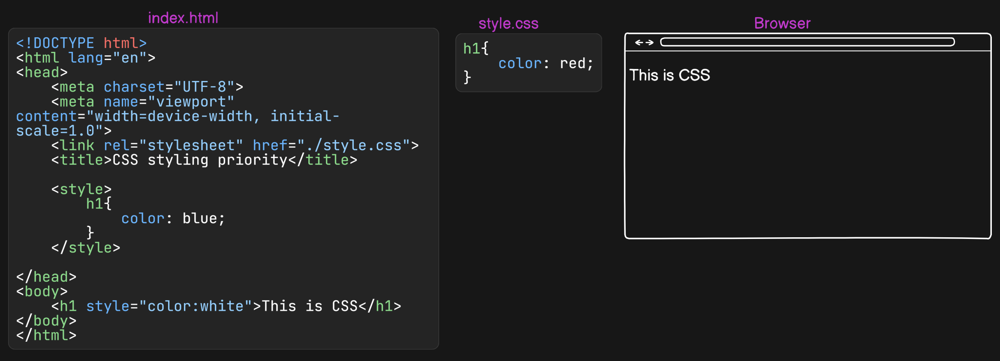

# Let us Start CSS From Root

> ### CSS used to style web pages

## What is CSS ?

- CSS stands for Cascading style sheet
  > Cascading meaning - Overlap, Override
- Used to design `HTML` structure

> What is HTML ?
>
> > CSS padhne aaye ho aapko HTML ke bare me jankari hogi, nehi hai to pehle HTML padhke aayo. Bina skeleton ke skin nehi lag sakta…

`Analogy` :-

- CSS ko aap esse samajh sakte hai ki ek sundar dikhane wale technique. Jese ki ek skeleton (jo CID mai dikh te ho aur Biology lab mai to zaroor dekhen hoge) bhayanak lagta hai na, usse HTML kehte hai web ki language mai, uske upar skin ke layer laga denge to sundar lagega na, jo ek human ki tarah dikhega, ussi skin ko web ki language mai CSS kehte hai.

---

## Why CSS ?

- For making the HTML structure beautiful.

- Nowadays, we don't use plain CSS. Instead, we use Bootstrap and Tailwind CSS, which are frameworks for CSS.

---

## How to use CSS ? :-

We can use CSS in three ways.

- Inline CSS

- Internal CSS

- External CSS

### Inline CSS :-

- Inline CSS is added directly where we want to apply the style.
- example:- `<h1 style="color:blue;">This is Inline CSS</h1>`

> It is inline CSS, where an h1 tag has its text color set to blue.

### Internal CSS :-

- Internal CSS is added in the head section of HTML file
- Example:-

  ```css
  <!DOCTYPE html>
  <html>
  <head>
  <style>
  body {
    background-color: '#fff';
  }

  h1 {
    color: cyan;
  }
  </style>
  </head>
  <body>

  <h1>This is a Internal CSS</h1>

  </body>
  </html>
  ```

  > It is Internal CSS define with a style tag in the head section. iska matlab ye nehi ki aap style section ko body mai nehi dal sakte, ye galat nehi hoga but ye recommend nehi hai kyuki iska kuchh reason hai

> Why we prefer style tag in head section but not in body section
>
> > Because there are some valid reasons. Some reasons are given below.
>
> 1. Page load timing:- jab style tag head section mai rahe to browser ko pehle se pata hai ki kaunsa CSS apply karna hai, so page design hoke render hota hai lekin jab style tag body section mai rahe to browser pehle content load karega uske baad styling ko load karega, try karo aur dekho ek flash sa dikhne ko mil sakta hai kuchh jyada code likhne ki zaroorat hogi nehi to aap ka system itna fast kaam karega aap wo flash bhi nehi dekh sakte. <br/>
> 2. User Experiences:- Aapka page jab render hota hai, to users ko ek smooth experience milna chahiye. Agar page pehle plain text ke saath load ho aur phir design badle, to wo user ko achha nahi lagega. Page ka design aur layout ek saath dikhna chahiye, jo tabhi possible hai jab CSS `<head>` me ho.

### External CSS :-

- External CSS is used by creating a file with a .css extension and linking it in the head section of an .html file using a link tag.
  

> Summary of this Diagram
>
> > There are three sections in the image above. One of the files is `index.html`, which is an HTML file and serves as the entry point for the browser. Another section is a CSS file named `style.css`, and the third section is a browser, which displays the output (essentially a simple website).In the `index.html` file, there is a `<link>` tag with a rel attribute set to stylesheet, which links to style.css using a relative file path (./style.css).There are two types of file paths absolute file path and relative file path.

### Priority of CSS Styling:

- The first priority is Inline CSS, followed by Internal CSS, and finally External CSS.



> Summary Of the Diagram:-
>
> > The diagram consists of three sections: index.html, style.css, and the Browser.

1. index.html: An HTML file that serves as the entry point to the browser.

2. style.css: An external CSS file connected to the HTML file via the <link> tag.

3. Browser: The output screen where the simple website is displayed.

The diagram has three types of CSS:

→ External CSS: In the external CSS file, the h1 text color is set to red. Here h1 is known as Selector.

→ Internal CSS: In the internal CSS (written inside the `<style>` tag in the `<head>` section), the h1 text color is set to blue.

→ Inline CSS: In the inline CSS (directly written in the h1 tag), the h1 text color is set to white.

- In the browser, the h1 text appears white because inline CSS has the highest priority among all CSS styles.

- By default, the h1 text color is black, which is the browser’s default style. However, default styles may vary across different browsers. Since inline CSS overrides both internal and external CSS, the h1 text color displays as white in the browser.

#### Analogy:-

> Isko ham esse samajh sakte hai ki Inline CSS hamare ghar ka log jese hote hai jo hamare liye sabse adhik important hote hai jinko hame adhik priority dete hai, Internal CSS hamare relation or friends ki tarah hote hai jinko hame ghar ki log se thoda kam priority dete hai aur External CSS bahar ki logo ki tarah hote hai jinko ham sabse kam priority dete hai…

#### Let us know about Selector :-

- In general term Selector meaning who selects.

- In CSS there are 5 types of Selectors.

  - Simple Selector based on ID, Class and Name
  - Combinator Selector
  - Pseudo-class Selector
  - Pseudo-elements Selector
  - Attribute Selector

- We will learn about Selectors in next article.

---

It's all about the basics of CSS. In one article, it's impossible to cover everything about CSS.

Links :- [css_basics](https://css-basics-in-simple-way.hashnode.dev/let-us-start-css-from-root#heading-how-to-use-css)

> If you really like this article, please go to the link and like and hit subscribe
