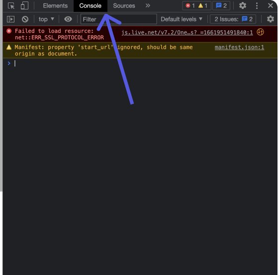
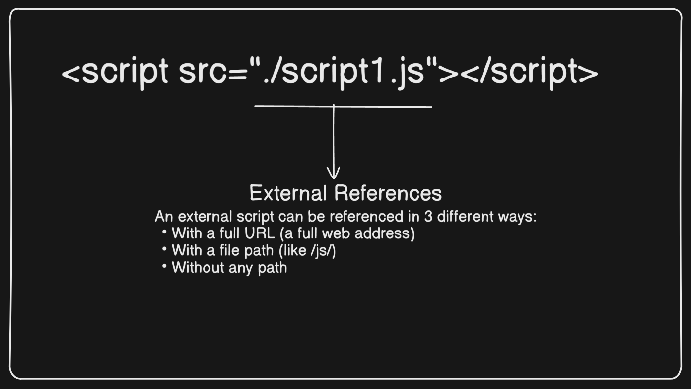

# Basic of JavaScript

## What is JavaScript ?

- JavaScript is a high level programming language that is used to create dynamic web pages.
- JavaScript is the only programming language that web browsers natively understand.

> What the above line mean - what is natively understand by Browser ?

- Other languages like TypeScript, Python (via frameworks like Flask/Django), and PHP can be used in web development, but they need to be compiled or processed into JavaScript or HTML before browsers can understand them.

### History of JavaScript :

- The Original JavaScript ES1 ES2 ES3 (1997-1999)
- The First Main Revision ES5 (2009)
- The Second Revision ES6 (2015)
- The Yearly Additions (2016, 2017 ... 2021, 2022)

### A common questions.

1. How to install JavaScript ?

   Ans:-

   - JavaScript is not needed to install
   - JavaScript is already running in our browser, on our computer, on our tablet, and on our smart-phone.
   - Node.js is a runtime for JavaScript – It allows running JavaScript outside the browser (for backend development).



> We can run JavaScript in out console of browser

## Why JavaScript needed ?

- In this era, JavaScript is an important programming language, need to build web apps and mobile apps.
- We use react or angular for frontend projects, they are the JavaScript libraries.
- We use react-native and flutter.
- React-native is library of JavaScript but incase of flutter, it is based on Dart(made by Google).
  > But behind the scene Dart is compiled into JavaScript to run in browsers.

---

## Why Study JavaScript?

JavaScript is one of the 3 languages all web developers must learn:

1.  HTML to define the content of web pages

2.  CSS to specify the layout of web pages

3.  JavaScript to program the behavior of web pages

---

## How to use JavaScript ?

> As we know Html and css. For JavaScript we have to injected in our .html file.

#### **We can injected JavaScript to our console in two ways.**

#### 1. Internal JavaScript :-

- using `<script>` tag
- We can use the script tag in our head or body section.
- In head section:-

```javascript
<!DOCTYPE html>
<html>
<head>
<script>
function myFunction() {
document.getElementById("demo").innerHTML = "Paragraph changed.";
}
</script>
</head>
<body>
<h2>Demo JavaScript in Head</h2>

<p id="demo">A Paragraph</p>
<button type="button" onclick="myFunction()">Try it</button>

</body>
</html>
```

- In body section :-

```javascript
<!DOCTYPE html>
<html>
<body>

<h2>Demo JavaScript in Body</h2>

<p id="demo">A Paragraph</p>

<button type="button" onclick="myFunction()">Try it</button>

<script>
function myFunction() {
document.getElementById("demo").innerHTML = "Paragraph changed.";
}
</script>

</body>
</html>
```

> Don't think of these what written in the function. we will go through

> These code is from w3school

#### 2. External JavaScript

- Creating a file script.js in the same folder where the .html file is present.
- We inject the script.js in the .html using `<script src="./script.js"></script>` tag. Both in head or body section

- in head section

  ```javascript
  <!DOCTYPE html>
  <html lang="en">
  <head>
     <title>External JavaScript in Head</title>
     <script src="script.js"></script>
  </head>
  <body>
     <h1>Hello, World!</h1>
  </body>
  </html>
  ```

- in body section :-

  ```javascript
  <!DOCTYPE html>
  <html lang="en">
  <head>
     <title>External JavaScript in Body</title>
  </head>
  <body>
     <h1>Hello, World!</h1>
     <script src="script.js"></script>
  </body>

  ```

  

> ### What is difference between when we inject .js file in head section and body section ?

We can first need to know advantage and disadvantage when we inject JavaScript file in head or body section.

### In head section :-

#### Advantages :-

- Loads the external script.js file before the page renders.

#### Disadvantage :-

- Blocks page rendering until the script is fully loaded.

### In body section :-

#### Advantages :-

- Faster Page Rendering
- Avoids Blocking HTML Parsing
- Improves Performance & SEO

#### Disadvantges :-

- JavaScript Executes Last
- Potential Flash of Unstyled Content (FOUC)
- Not Ideal for Critical JavaScript

> Then which is the best way.

We can inject JavaScript in out head section but using an defer keyword.

```javascript
<head>
  <script src="script.js" defer></script>
</head>
```

✅ Improves page loading speed.

✅ Recommended for most use cases.

---

---

---

## Now we have idea about some little about JavaScript...

Let us elaborate Article topics

- Understanding variables and Datatypes in JavaScript.
- The JavaScript operator, the basic we need to know.
- Control flow in JavaScript, if-else, switch

### Understanding variables and Datatypes in JavaScript.

#### **Variables:-**

- The term 'variable' itself suggests that its value can change
- It is a container where value can store.

---

#### JavaScript variable:-

- We can initialize variable using let, const or var(after ES6 we don't use it)
- We first prefer const then let. We don't learn about var here.

##### **_const_ :-**

- It means constant, where value will not need to be change.
- Example:- Your name
  > Hamare name issi janma mai to change nehi hone wala...

##### **_let_ :-**

- Where value can be change.
- Example:- Your age
  > Har saal aapke janma din mai aapke age ek saal badh jaata hai, lekin let ka initialize value ghat bhi sakta hai, kitna achha hota na age bhi ghata sakte to😞

```javascript
const name = "Priyansu";
let age = 25;

console.log(name); // Priyansu
console.log(age); // 25
```

> mera name ko change karke dekhe kya, kya change hoga ?

```javascript
const name = "Priyansu";
let age = 25;

name = "Babuni";
console.log(name); //script.js:4 Uncaught TypeError: Assignment to constant variable.
```

> agar aap isse browser ka snippet pe jake ek snippet banake karte to ye error nehi dega, ye bas value change nehui karega, lekin console aap ko error dega ki constant variable ka value nehi change kar sakte..

> Age ki value ko change karke dikhe kya ?

```javascript
const name = "Priyansu";
let age = 25;

age = 26;
console.log(age); // 26
```

> Isse hamne dekhe ki const ka value change nehi ho sakta lekin let ka valye change hota rehta hai but kyun ?

Now, It is time for learn how JavaScript engine store the variable in memory.

- JavaScript engine (Ex:- v8 for chrome) uses two types of memory storage for its variables
- One is stack memory and another is heap memory.
