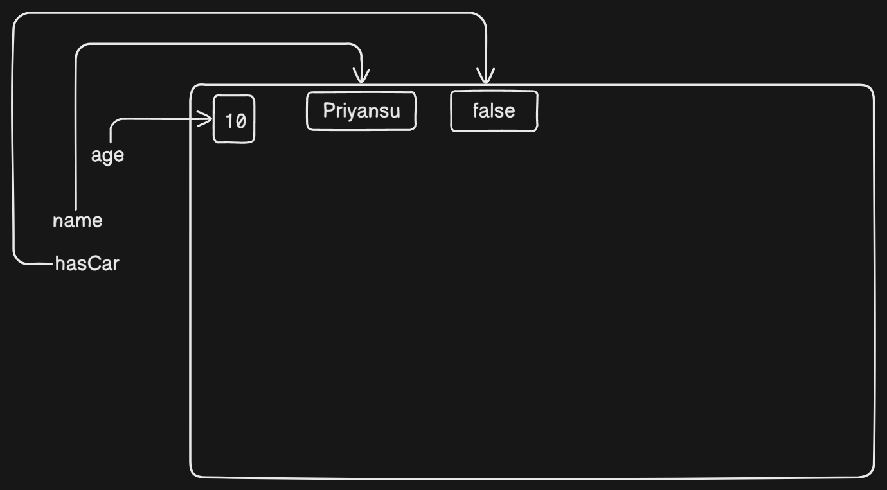

# Basic of JavaScript

## What is JavaScript ?

- JavaScript is a high level programming language that is used to create dynamic web pages.
- JavaScript is the only programming language that web browsers natively understand.

> What the above line mean - what is natively understand by Browser ?

- Other languages like TypeScript, Python (via frameworks like Flask/Django), and PHP can be used in web development, but they need to be compiled or processed into JavaScript or HTML before browsers can understand them.

### History of JavaScript :

- The Original JavaScript ES1 ES2 ES3 (1997-1999)
- The First Main Revision ES5 (2009)
- The Second Revision ES6 (2015)
- The Yearly Additions (2016, 2017 ... 2021, 2022)

### A common questions.

1. How to install JavaScript ?

   Ans:-

   - JavaScript is not needed to install
   - JavaScript is already running in our browser, on our computer, on our tablet, and on our smart-phone.
   - Node.js is a runtime for JavaScript – It allows running JavaScript outside the browser (for backend development).


> We can run JavaScript in out console of browser

## Why JavaScript needed ?

- In this era, JavaScript is an important programming language, need to build web apps and mobile apps.
- We use react or angular for frontend projects, they are the JavaScript libraries.
- We use react-native and flutter.
- React-native is library of JavaScript but incase of flutter, it is based on Dart(made by Google).
  > But behind the scene Dart is compiled into JavaScript to run in browsers.

---

## Why Study JavaScript?

JavaScript is one of the 3 languages all web developers must learn:

1.  HTML to define the content of web pages

2.  CSS to specify the layout of web pages

3.  JavaScript to program the behavior of web pages

---

## How to use JavaScript ?

> As we know Html and css. For JavaScript we have to injected in our .html file.

#### **We can injected JavaScript to our console in two ways.**

#### 1. Internal JavaScript :-

- using `<script>` tag
- We can use the script tag in our head or body section.
- In head section:-

```javascript
<!DOCTYPE html>
<html>
<head>
<script>
function myFunction() {
document.getElementById("demo").innerHTML = "Paragraph changed.";
}
</script>
</head>
<body>
<h2>Demo JavaScript in Head</h2>

<p id="demo">A Paragraph</p>
<button type="button" onclick="myFunction()">Try it</button>

</body>
</html>
```

- In body section :-

```javascript
<!DOCTYPE html>
<html>
<body>

<h2>Demo JavaScript in Body</h2>

<p id="demo">A Paragraph</p>

<button type="button" onclick="myFunction()">Try it</button>

<script>
function myFunction() {
document.getElementById("demo").innerHTML = "Paragraph changed.";
}
</script>

</body>
</html>
```

> Don't think of these what written in the function. we will go through

> These code is from w3school

#### 2. External JavaScript

- Creating a file script.js in the same folder where the .html file is present.
- We inject the script.js in the .html using `<script src="./script.js"></script>` tag. Both in head or body section

- in head section

  ```javascript
  <!DOCTYPE html>
  <html lang="en">
  <head>
     <title>External JavaScript in Head</title>
     <script src="script.js"></script>
  </head>
  <body>
     <h1>Hello, World!</h1>
  </body>
  </html>
  ```

- in body section :-

  ```javascript
  <!DOCTYPE html>
  <html lang="en">
  <head>
     <title>External JavaScript in Body</title>
  </head>
  <body>
     <h1>Hello, World!</h1>
     <script src="script.js"></script>
  </body>

  ```

  

> ### What is difference between when we inject .js file in head section and body section ?

We can first need to know advantage and disadvantage when we inject JavaScript file in head or body section.

### In head section :-

#### Advantages :-

- Loads the external script.js file before the page renders.

#### Disadvantage :-

- Blocks page rendering until the script is fully loaded.

### In body section :-

#### Advantages :-

- Faster Page Rendering
- Avoids Blocking HTML Parsing
- Improves Performance & SEO

#### Disadvantges :-

- JavaScript Executes Last
- Potential Flash of Unstyled Content (FOUC)
- Not Ideal for Critical JavaScript

> Then which is the best way.

We can inject JavaScript in out head section but using an defer keyword.

```javascript
<head>
  <script src="script.js" defer></script>
</head>
```

✅ Improves page loading speed.

✅ Recommended for most use cases.

---

---

---

#### Now we have idea about some little about JavaScript...

Let us elaborate Article topics

- Understanding variables and Datatypes in JavaScript.
- The JavaScript operator, the basic we need to know.
- Control flow in JavaScript, if-else, switch

### Understanding variables and Datatypes in JavaScript.

#### **Variables:-**

- The term 'variable' itself suggests that its value can change
- It is a container where value can store.

---

#### JavaScript variable:-

- We can initialize variable using let, const or var(after ES6 we don't use it)
- We first prefer const then let. We don't learn about var here.

##### **_const_ :-**

- It means constant, where value will not need to be change.
- Example:- Your name
  > Hamare name issi janma mai to change nehi hone wala...

##### **_let_ :-**

- Where value can be change.
- Example:- Your age
  > Har saal aapke janma din mai aapke age ek saal badh jaata hai, lekin let ka initialize value ghat bhi sakta hai, kitna achha hota na age bhi ghata sakte to😞

```javascript
const name = "Priyansu";
let age = 25;

console.log(name); // Priyansu
console.log(age); // 25
```

> mera name ko change karke dekhe kya, kya change hoga ?

```javascript
const name = "Priyansu";
let age = 25;

name = "Babuni";
console.log(name); //script.js:4 Uncaught TypeError: Assignment to constant variable.
```

> agar aap isse browser ka snippet pe jake ek snippet banake karte to ye error nehi dega, ye bas value change nehui karega, lekin console aap ko error dega ki constant variable ka value nehi change kar sakte..

> Age ki value ko change karke dikhe kya ?

```javascript
const name = "Priyansu";
let age = 25;

age = 26;
console.log(age); // 26
```

> Isse hamne dekhe ki const ka value change nehi ho sakta lekin let ka valye change hota rehta hai but kyun ?

Now, It is time for learn how JavaScript engine store the variable in memory.

- JavaScript engine (Ex:- v8 for chrome) uses two types of memory storage for its variables
- One is stack memory and another is heap memory.
- We will learn evrything after learn about object in datatypes section.

#### JavaScript Datatypes :-

##### **In JavaScript Datatypes are 2 types.**

- Primitive Datatypes
- Non Primitive Datatypes

##### Primitive Datatypes :-

- These are immutable. when it stored then we can not change it.
- It stored directly in stack memory.
- The JavaScript language has 7 types of Primitive data types.

  1. Number
  2. String
  3. BigInt
  4. Boolean
  5. Undefined
  6. null
  7. symbol

###### 1. Number :-

- It can take numbers.

  - Number is also two types
    - Decimal (floating point number)
    - Integer

  ```javascript
  let age = 25; // Integer number
  let height = 5.5; // floating number

  console.log(typeof age); // number
  console.log(typeof height); // number
  ```

###### 2. String :-

- It takes words or letters and number also using double qoute ("") or single quote('').

  ```javascript
  let name = "Priyansu";
  let age = "26"; // here we take age as a string

  console.log(typeof name); // string
  console.log(typeof age); // string
  console.log(age); // '26'
  ```

  > Aap yehi soch sakte hai ki wahan mai name ke aage const use kiya tha lekin yahan let... ji mera marzi😊. Rajkumar Rao name change karke Rajkummar Rao ho gaye na

###### 3. BigInt :-

- It takes larger number like when we calculate the distance between two planets or two stars, that is a large number which can not use in number
- Here question can be what is the maximum number we can calculate with number datatypes..

  ```javascript
  console.log(Number.MAX_SAFE_INTEGER); // 9007199254740991 (2^53 - 1)
  console.log(Number.MIN_SAFE_INTEGER); // -9007199254740991 (-2^53 + 1)
  ```

###### 4. Boolean :-

- It stores value as either true or false.
- Ye hamare school headmaster ki tarah hai jo jyada kuchh nehi bolte sirg hmm ya naa mai answer dete hai🤣

  ```javascript
  const name = "Priyansu";
  let age = 25;
  let hasGf = false; // soch na bhi mat

  console.log(typeof hasGf); // boolean
  ```

###### 5. Undefined :-

- Iska saddha sidhha matlab hai abhi socha nehi baad mai dekhenge...
- No value assigned yet but can be required in future.

  ```javascript
  const name = "Priyansu";
  let age = 26;
  let willBeMarried;

  console.log(typeof willBeMarried); // undefined
  ```

  > Ye yaad rakh lijiye ji undefined or not defined same nehi hota. ye complete different hai. undefined ka matlab socha nehi hai aur not defined ka matlab pata nehi hai..

  ```javascript
  const name = "priyansu";
  let willBeMarried;

  console.log(hasCar); // Uncaught ReferenceError: isMarried is not defined
  ```

  > Ye error ka matlab ye hai ki memory mai nehi hai ye value

###### 6. null :-

- In JavaScript, null is a special value that represents "nothing" or "empty".
  ```javascript
  let value = null;
  console.log(value); // null
  ```
- When we want to check type of null, we don't get null, we will get object.
- By default in JavaScript all are objects.
- But incase of null, it is a bug of JavaScript and the founders don't try to solve it.
  ```javascript
  console.log(typeof null); // "object"
  ```
- Now, the question is why we need null, has it some work or it is useless..
- Let us consider a real world situation, when we login in a page like flipkart and we ordered something then we want to logout from flipkart beacause of some reasons.
- Then when we logout the value of user should be null, because we don't use undefined after logout.
  ```javascript
  let user = { name: "Priyansu", age: 25 };
  // User logs out, so we clear the data
  user = null;
  console.log(user); // null
  ```

###### 7. symbol :-

- Symbol is a unique and immutable primitive data type introduced in ES6 (ECMAScript 2015). It is used to create unique identifiers that won’t conflict with any other property keys.

- We can create a symbol using the Symbol() function:

```javascript
let sym1 = Symbol();
let sym2 = Symbol();
console.log(sym1 === sym2); // false  (Always unique!)
```

> **_Now you might have a question that if they are primitive and we know we can not change the value then how can We change the value later_**

> Let's break the above line with an example.

```javascript
let age = 10;
let name = "Priyansu";
let hasCar = false;

console.log(age); // 10
console.log(name); // Priyansu
console.log(hasCar); // false

age = 30;
name = "Babuni";
hasCar = true;

console.log(age); // 30
console.log(name); // Babuni
console.log(hasCar); // true
```

> How the all value changed if they are all primitive data types.

> When we initialize the value at first time the value stored in memory like this way.
> 

> When we changes the value the value stored like this.


> The value does not change. Only the variable points to another value.
> When the JavaScript engine found the value has no work. it deletes the values with its inbuild garbage collector.

> Programming language like C++ has no inbuild Garbage collector. It deleted manually.

---

---

##### Non Primitive Datatypes :-

- In JavaScript there are mainly 2 types of non primitve data types
  - array
  - object
- They can be modified.
- Stored in heap memory, but stack stores a reference (address) to it.

  ```javascript
  let obj1 = { name: "John" };
  console.log(obj1.name); // John
  ```

  > Let us understand how the non-primitive datatypes use hybrid memory means both stack and heap with a diagram.

  

  > The data of an object or array stored in heap memory but reference(address of the object/array) stored in stack memory.
  > Then when we try to change its value, it goes to stack memory and chcek its address then go to th heap memory and with th address and change the value.

  ```javascript
  let obj1 = { name: "John" };
  obj1.name = "Deo";

  console.log(obj1.name); // Deo
  ```

  

  > ### Now it is the time for learn some important things in JavaScript.

  ```javascript
  let name1 = "Priyansu";
  let name2 = name1;
  name2 = "Babuni";
  console.log(name1); // Priyansu
  console.log(name2); // Babuni
  ```

- > When we assign the value of name1 to name2 then the value stored to name2 also, let us understand with a diagram
  > 
  > In this diagram we can see that when we assign the name2 with name1, then the name2 variable also point to the name1 value.

- > But when we try to chnage the value of name2 as "Babuni" then it points to different value.
  > 
  > So here, the value does not change of name1 when we change the value of name2.

> #### But in case of object it should be different.

- As we know when we use an object to store value it used hybrid memory to save the data or value.
- The value of object stores in heap and its referrence stores in stack.\

  ```javascript
  let user1 = { name: "Priyansu" };
  let user2 = user1;
  console.log(user1.name); // Priyansu
  console.log(user2.name); // Priyansu
  ```

  

- When we change the value of user2 then it will also change the value of user1 because they both points to same address.

  ```javascript
  let user1 = { name: "Priyansu" };
  let user2 = user1;

  user2.name = "Babuni";
  console.log(user1.name); // Babuni
  console.log(user2.name); // Babuni
  ```

  ## 

> This is the copy of variable. There are two types of copy in JavScript.

- Shallow Copy
- Deep Copy

#### 1. Shallow copy :-

- It copies only the top-level properties of an object.
- It does not create a new copy of nested objects—instead, it copies their references.
- Let us learn with analogy, code and diagram.

> Analogy :-

- When water level is not deep we can called it shallow water level means we can touch the ground of under water, (ex:- swimming pool water)
  

> Code :-

```javascript
let user = {
  name: "Priyansu",
  details: { age: 25, city: "Cuttack" },
};

// Create a shallow copy, we can create shallow copy in different types.
// shallow copy using spread operator.
let shallowCopyUser = { ...user };

shallowCopyUser.details.age = 30;
shallowCopyUser.name = "Babuni";

console.log(user.name); // Priyansu
console.group(shallowCopyUser.name); // Babuni

console.log(user.details.age); // 30
console.log(shallowCopyUser.details.age); // 30
```

> Why here only the age changed according to the shallowCopy but the name did not change ?

- Remember what we learn about memory -> stack and heap memory.
- Let's understand working mechanism of shallow copy.

  

  > Please zoom a little bit to understand the diagram better.
  > Let us illustrate the diagram.

  - When we copy the user using spread operator then all value of user copied to the shallowCopyUser variable.
  - As we know primitive variable stores in stack and the non primitive variable stores using hybrid memory.
  - Here incase of name it stores in stack memory but incase of details it stores the data in heap and referrnece of data in stack memory.
  - In the diagram, I refer the user name in heap because user is an object same as shallowCopyUser.

  > When we try to change the details and name of the shallowCopyUser variable then.

  

  > It change the value of name in shallowCopyUser only but not in user because we know about the memory uses what we learn above
  > But in case of details object it changes both because it stores the referrence or address of that variable. so takes the address of the details variable and go to heap memory and change the value.

- We can create shallow copy in multiple ways.
  - Spread operator
  - using assign function
    ```javascript
    let shallowCopyUser = Object.assign({}, user);
    ```
  - using create
    ```javascript
    let shallowCopyUser = Object.create(user);
    ```

#### 2. Deep copy :-

- Deep copy ensures that nested objects are also cloned instead of referencing the original object.
  > What the above line means ?
- It means that Deep copy created a new object instead of pointing the same object like shallow copy.

  ```javascript
  let user = {
    name: "Priyansu",
    details: { age: 25, city: "Cuttack" },
  };

  // Deep copy using structuredClone
  let deepCopyUser = structuredClone(user);

  deepCopyUser.details.age = 30;
  deepCopyUser.name = "Babuni";

  console.log(user.name); // "Priyansu"
  console.log(deepCopyUser.name); // "Babuni"

  console.log(user.details.age); // 25 (Unchanged!)
  console.log(deepCopyUser.details.age); // 30 (Changed in deepCopyUser)
  ```

- Describe the code:-

  - In this code we assign a variable 'user' using let.
  - Creating a deep copy using `structureClone()`.
  - Try to change the name and age of the copy variable.
  - Check when we change the copy variable, it will change the main user or not.
  - Because deep copy create its own object, so, user does not change.

- We can create deep copy in multiple ways.
  - using `structuredClone`
  - using `JSON.parse(JSON.stringify(user))`

> Analogy :-

- Deep water where we can not touch the ground, yadi app swimming nehi jante to aap paka mar jaoge.

> Diagram :-
> 

> After change the value of deepCopyUser.
> 

### Conclusion :-

- In this article we learned about javascript-basics, how to inject javascript file to html file, variables and data types, shallow-copy and deep-copy
