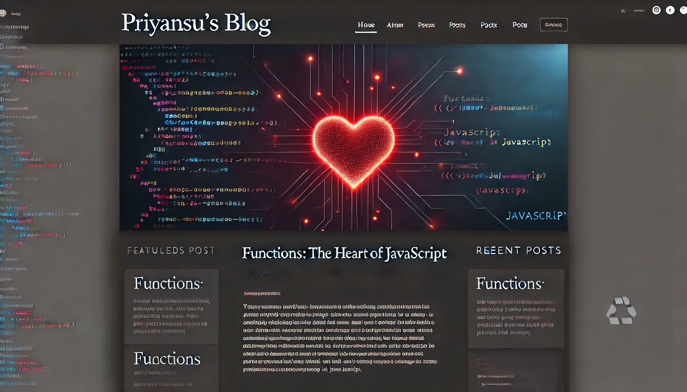

# Functions in JavaScript

- Before going to deep in functions, we have a queation that it is functions or methods.
- If they are same why we called them with different names.
- If they are different then what is difference between them.

> The only answer is when we use function in object is known as methods.
> Function is stand alone.

- Functions

  ```javascript
  function adding(a, b) {
    return a + b;
  }
  let res = adding(2, 3);
  console.log(res);
  ```

- Methods

  ```javascript
  class Person {
    constructor(fname, lname) {
      this.fname = fname;
      this.lname = lname;
    }
    getFullName() {
      return `${this.fname} ${this.lname}`;
    }
  }

  const person = new Person("John", "Doe");
  console.log(person.getFullName()); // Output: John Doe
  ```

---

---

### Let us deep dive in function :-

## What is function ?

- A function is a block of code that performs a specific task or set of tasks.
- It is used to organize code, improve reusability, and make programs more readable.

## Why we need function ?

- If without the function our code can run but we need functon because we don't want to duplicate our code everytime.
- Example:-

  - If we want to write a code that it returns sum of two numbers.

    - Without function

    ```javascript
    let a = 10;
    let b = 20;
    console.log(a + b); // 30

    // If there will be another number to get sum then we have to repeat the same code
    let x = 20;
    let y = 4;
    console.log(x + y); // 24
    ```

    > Function can make it simple.

    ```javascript
    function add(a, b) {
      return a + b;
    }
    let res = add(2, 3);
    console.log(res); // 5
    let result = add(4, 5);
    console.log(result); // 9
    ```

    > It seems that we use more lines where we functions than where we do not use function. But when there are so many works, It is quite impossible to do the works without functions.

## How to use function ?

- In JavaScript there are two types of function
  - Synchronous function
  - Asynchronous function (async fun)
- We can write function is two ways.
  - Normally using function keyword
    ```javascript
    function add(x, y) {
      return x + y;
    }
    ```
  - Arrow function
    `javascript
    const add = (x, y) => {
      return x+y
    }
   `
    > ### First we learn about types of writing function then we will learn about types of function in JavaScript.

### Normally function using function keyword :-

> ##### As you are here(article by Priyansu Dash), You should learn how JavaScript engine works behind the scene...
>
> So, let us go deeper and deeper, It will be beneficial for our interviews.

#### How JavaScript works ? :-

- Everything in JavaScript happens inside an execution context.
- When we run a `.js` file, JavaScript engine creates an global execution context (GEC).
  > ##### If the file is empty, can JavaScript engine creates an execution context ?
  >
  > > yes, because a shortest `js` file is an empty file
- ##### **Execution context** :-
  -
