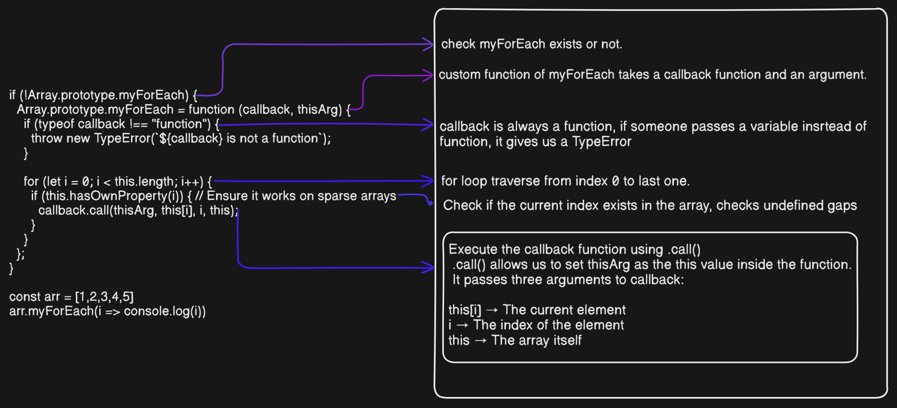

# Polyfills in JavaScript

## What is polyfill ?

- Polyfill is a JavaScript library that provides missing or polyfill functionality for older browsers.
- Not for only older browser, but for new browser also
- If I want to design a app, and there is some JavaScript function which are unknwon for browser, I have to design my own polyfills and send it to the browser before my page loads, otherwise my app will crash in the browser.
  > We’re going to learn how to customize our own polyfills in this article. So grab your favorite drink, get comfortable on your bed, sofa, or chair, and follow along as we break it down step by step! 🚀

---

## Why we need Polyfills ?

- Let us go with a real life example.
  > Imagine your phone’s storage is completely full, but you need to save some important files to a USB pendrive.

> Problem?

- Your phone doesn’t have a USB Type-A port to directly connect the pendrive.

> Solution?

- You use a Type-A to Type-C connector to bridge the gap and make the pendrive compatible with your phone. In the same way, a polyfill acts as a connector in JavaScript, allowing older browsers (that lack modern features) to access and use those features, ensuring everything works smoothly.

  

---

## How to write polyfills ?

> For now we will write polyfills of predefined functions

### We will learn these by making polyfills

- push()
- pop()
- shift()
- unshift()
- concat()
- splice()
- forEach()
- map()
- filter()
- reduce()

> Before write the polyfills we have to think something.

- What the function does
- what is the signature of the function.
- Is the function return something or not.

### **1. push()**:-

- What `push()` does ?
  - `push()` uses in array
  - It takes value and add the value as last element of an array.
- Signature of `push()` :-
  - Belongs to Array.prototype (so it works on all arrays).
  - Takes any number of arguments.
  - Modifies the original array by adding elements at the end.
- It doesn't return by default, but incase we want value we have to return the array where we use push method

  > We can understand from code better.

  ```javaScript
  const fruitBasket = ['🍎', '🍇', '🍊']
  if(!Array.prototype.myPush){
    Array.prototype.myPush = function(...fruits){
    let length = this.length
    for (let i = 0; i < fruits.length; i++) {
      this[length] = fruits[i];
      length++;
    }
    return length;
  }
  }
  fruitBasket.myPush('🍍', '🍒')
  console.log(fruitBasket) // ['🍎', '🍇', '🍊', '🍍', '🍒']
  ```

  > Let us understand the code line by line through diagram.
  > 
  > A typo is here in the image only. Find what is it...

  > Understand it from my handwritten note

---

### **2. pop()**:-

- What `pop()` does ?
  - Delete the last element from the array.
  - It doesn't take any parameter.
- Signature of `pop()` :-

  - Belongs to Array.prototype (so it works on all arrays).
  - Returns the last element.
  - Removes one element at a time.

```javascript
const fruitBasket = ["🍎", "🍇", "🍊"];

if (!Array.prototype.myPop) {
  Array.prototype.myPop = function () {
    //  check array is empty or not, if it is empty return 'Your array is empty'
    if (this.length === 0) {
      return "Your array is empty";
    }
    // get the last element
    let last_ele = this[this.length - 1];
    // we can not delete, we just decrease our length
    this.length = this.length - 1;
    return last_ele;
  };
}

let last = fruitBasket.myPop();
console.log(fruitBasket); // ['🍎', '🍇']
console.log(last); // '🍊'
```

> Let us understand the code line by line through diagram.
> 

### **3. shift()** :-

- What `shift()` does ?
  - `shift()` uses in array.
  - The `shift()` method in JavaScript removes the first element from an array and returns it.
- Signature of `shift()`
  - Belongs to Array.prototype (so it works on all arrays).
  - Does not take any arguments

> Let us go to code part.

```javascript
if (!Array.prototype.myShift) {
  Array.prototype.myShift = function () {
    if (this.length === 0) return undefined;

    let firstElement = this[0];

    // Shift all elements to the left
    for (let i = 0; i < this.length - 1; i++) {
      this[i] = this[i + 1];
    }

    delete this[this.length - 1];
    this.length--;

    return firstElement;
  };
}

// Example:
let fruits = ["🍎", "🍇", "🍊"];

let shiftedFruit = fruits.myShift();
console.log(shiftedFruit); // '🍎'
console.log(fruits); //['🍇', '🍊']
```

> Let us understand the code line by line
> 

> We can do the same thing without keyword of delete just decrease the length like what we learn in mypop(). Difference is the deleted element will be present in memory until JavaScript find it unuseful, when JavaScript engine finds it unuseful, its inbuild garbage collector delete the one in case of when we not use delete keyword.

> Second question why we write `this` again and again, why we do not write the array name what we use in the code.
> Example:- Why we do not write fruits or fruitsArray ?

### **this** :-

- It can be a separate artcile, now we have only to know what if I write the array name instead of `this`, we can get same output but We create here polyfill not any normal function.
- Polyfiil means we can use it anywhere.
- It is not mandatory that when we use this polyfill in another javascript file, the array name not be fruitBasket or fruits.
- There it should not workable, it will return fruitBasket not defined.

- Example:-

  ```javascript
  if (!Array.prototype.myShift) {
    Array.prototype.myShift = function () {
      if (fruits.length === 0) return undefined; //  Error if 'fruits' is not defined

      let firstElement = fruits[0];

      // Shift all elements to the left
      for (let i = 0; i < fruits.length - 1; i++) {
        fruits[i] = fruits[i + 1];
      }

      delete fruits[fruits.length - 1];
      fruits.length--;

      return firstElement;
    };
  }

  // Example:
  let fruits = ["🍎", "🍇", "🍊"];
  let veggies = ["🥕", "🥦", "🌽"];

  fruits.myShift(); //  It will work fine
  veggies.myShift(); //  Error (Trying to access 'fruits' in 'veggies')
  ```

### **4. unshift()** :-

- What `unshift()` does ?
  - Used in array only.
  - Add a new value at 0th index of the array.
- Signature of `unshift()`
  - Belongs to Array.prototype, so it works on all arrays.
  - Takes any number of parameters.
  - Modifies the original array by adding some elements at the front.
- unshift() returns the new length of the array,

> Code part- polyfill for unshift:-

```javascript
if (!Array.prototype.oyeKhichak) {
  Array.prototype.oyeKhichak = function (...items) {
    let itemsLength = items.length;
    let arrayLength = this.length;

    // create place for new elements
    for (let i = arrayLength - 1; i > -1; i--) {
      this[i + itemsLength] = this[i];
    }
    // insert in first of the array
    for (let j = 0; j < itemsLength; j++) {
      this[j] = items[j];
    }
    return this.length;
  };
}

const fruitBasket = ["🍎", "🍇", "🍊"];
fruitBasket.oyeKhichak("🍍", "🍒");
console.log(fruitBasket);
```

> Diagram for understanding the code better.
> 

> control flow of first for loop

#### Iteration Breakdown

| `i` | `this[i]`                 | `this[i + itemsLength]`               |
| --- | ------------------------- | ------------------------------------- |
| `2` | `"🍊"` → `this[4] = "🍊"` | `["🍎", "🍇", "🍊", undefined, "🍊"]` |
| `1` | `"🍇"` → `this[3] = "🍇"` | `["🍎", "🍇", "🍊", "🍇", "🍊"]`      |
| `0` | `"🍎"` → `this[2] = "🍎"` | `["🍎", "🍇", "🍎", "🍇", "🍊"]`      |

### **5. concat()** :-

- What `concat()` does ?
  - Merge two arrays.
  - syntax:- `arr1.concat(arr2)`
- Signature of `concat()`
  - Belongs to Array.prototype, so works on all arrays.
  - Does not affect previous arrays, return a new array

> code part - polyfill for concat

```javascript
if (!Array.prototype.arrayMerger) {
  Array.prototype.arrayMerger = function (arr) {
    let merge_array = [...this]; // copy the array which calls the concat()/applyMerger()

    for (let i = 0; i < arr.length; i++) {
      merge_array.push(arr[i]);
    }
    return merge_array;
  };
}

const array1 = [1, 2, 3];
const array2 = [1];

console.log(array1.arrayMerger(array2)); // [1, 2, 3, 1]
```

> Diagram to understand the code better.
> 

### **6. splice()** :-

- What `splice()` does ?
  - The splice() method modifies an array by adding, removing, or replacing elements at a specific index.
- Signature of `splice()`

  - It changes the original array.
  - It returns an array of removed elements.

- Syntax of `splice()`:-

  ```javascript
  // Removing elements
  const fruits = ["🍎", "🍊", "🍌", "🍇"];
  const removed = fruits.splice(1, 2);

  console.log(fruits); // ["🍎", "🍇"]
  console.log(removed); // ["🍊", "🍌"]

  // adding elements
  fruits.splice(1, 0, "🍍", "🍉");

  console.log(fruits); //  ['🍎', '🍍', '🍉', '🍇']

  // replacing elements
  fruits.splice(1, 1, "🥝");

  console.log(fruits); // ['🍎', '🥝', '🍉', '🍇']
  ```

> code part - polyfills of `splice()`

```javascript
if (!Array.prototype.mySplice) {
  Array.prototype.mySplice = function (start, deleteCount, ...items) {
    let originalLength = this.length;
    let removedItems = [];

    if (start < 0) {
      start = originalLength + start;
      if (start < 0) start = 0; // Prevent out-of-bounds
    }

    if (deleteCount > originalLength - start) {
      deleteCount = originalLength - start;
    }

    for (let i = 0; i < deleteCount; i++) {
      removedItems.push(this[start + i]);
    }

    let newArray = [
      ...this.slice(0, start),
      ...items,
      ...this.slice(start + deleteCount),
    ];

    this.length = 0;
    for (let i = 0; i < newArray.length; i++) {
      this[i] = newArray[i];
    }

    return removedItems;
  };
}

let fruits = ["🍎", "🍊", "🍌", "🍇"];
let removed = fruits.mySplice(1, 2, "🥝", "🍍");

console.log(fruits); // ["🍎", "🥝", "🍍", "🍇"]
console.log(removed); // ["🍊", "🍌"]
```

> Break the code line by line-> I do not use diagram here because diagram would be very large

- `if (!Array.prototype.mySplice)` :- check the function exists or not
- `Array.prototype.mySplice = function (start, deleteCount, ...items) ` :- Define my function which takes 3 parameters.
  - `start`: The index where modifications begin.
  - `deleteCount`: Number of elements to remove.
  - `...items`: The elements to be added at start index.
- `let originalLength = this.length `:- store the length of the array
- `let removedItems = []` :- Initialize an array to store remove items.
- `if (start < 0)` :- Handle negative value as we know in array negative index also count.
  - Example:- `array[-1]` :- It is the last index of the array
  - `originalLength + start` converts negative values to valid indices.
  - If `start` is still negative after adjustment, set it to 0.
- `if (deleteCount > originalLength - start) {
    deleteCount = originalLength - start
}`

  - We can not delete more than elements present in the array
  - The if condition ensures it.

- `for (let i = 0; i < deleteCount; i++) {
    removedItems.push(this[start + i]);
  }
`
  - Loops through deleteCount and stores removed elements in removedItems.
- `let newArray = [
    ...this.slice(0, start), 
    ...items,
    ...this.slice(start + deleteCount), 
];`
  - `...this.slice(0, start)` :- Elements before start index (this.slice(0, start)).
  - ` ...items` :- New elements
  - `...this.slice(start + deleteCount)` :- Remaining elements after deleteCount is removed
- `this.length = 0;` clear the array
- `for (let i = 0; i < newArray.length; i++) {
    this[i] = newArray[i];
  }
`

  - copy modified elements

- return the elements

### **7. forEach()** :-

- What `forEach()` does ?
  - The `forEach()` method is used to iterate over an array and execute a function for each element.
- Signature of `forEach()`
  - Belongs to Array.prototype, so works on all arrays.
  - Does not affect previous arrays, return a new array
- Example for `forEach()`:-
  - Using normal function :-
  ```javascript
  const fruits = ["🍎", "🍌", "🍇", "🍊"];
  fruits.forEach(function (fruit) {
    console.log(fruit);
  });
  ```
  - Using arrow function :-
  ```javascript
  const fruits = ["🍎", "🍌", "🍇", "🍊"];
  fruits.forEach((fruit) => console.log(fruit));
  ```
- `forEach()` does not return anything.

> code part for custom forEach() :-

```javascript
if (!Array.prototype.myForEach) {
  Array.prototype.myForEach = function (callback, thisArg) {
    if (typeof callback !== "function") {
      throw new TypeError(`${callback} is not a function`);
    }

    for (let i = 0; i < this.length; i++) {
      if (this.hasOwnProperty(i)) {
        callback.call(thisArg, this[i], i, this);
      }
    }
  };
}

const arr = [1, 2, 3, 4, 5];
arr.myForEach((i) => console.log(i));
```

> Understand the code better through diagram.
> 

### **8. map()** :-

- What `map()` does :-
  - Does the same work what forEach does.
  - The only difference is map returns new array while forEach not.
- Signature of `map()` :-
  - Belongs to Array.prototype, so it works on all arrays.
  - Iteratate each element in an array
- Returns a new array.

- Syntax :-
  ```javascript
  const arr = [1, 2, 3, 4, 5];
  const new_arr = arr.map((i) => i ** 2);
  console.log(new_arr); // 1, 4, 9, 16, 25
  ```
  > Pollyfills of `map()` method
  ```javascript
  if (!Array.prototype.myMap) {
    Array.prototype.myMap = function (cb) {
      if (typeof cb !== "function") {
        throw new TypeError(`${cb} is not a function`);
      }
      const result = [];
      for (let i = 0; i < this.length; i++) {
        const val = cb(this[i], i);
        result.push(val);
      }
      return result;
    };
  }
  ```
  > Break each line of code.
  > 

### **9. filter()** :-

- What `filter()` does ?
  - We can figure about it from his name.
  - It filters what we need from an array
- Signature of `filter()` :-
  - Belongs to Array.prototype. sp it works all on array.
- Returns a new array.

- Syntax of `filter()`:-

  ```javascript
  const arr = [1, 2, 3, 4, 5, 6];
  const new_arr = arr.filter((i) => i % 2 === 0);
  console.log(new_arr);
  ```

  > Polyfill of `filter()`:-

  ```javascript
  if (!Array.prototype.myFilter) {
    Array.prototype.myFilter = function (cb) {
      if (typeof cb !== "function") {
        throw new TypeError(`${cb} is not a function`);
      }
      const result = [];
      for (let i = 0; i < this.length; i++) {
        if (cb(this[i])) {
          result.push(this[i]);
        }
      }
      return result;
    };
  }

  const arr = [1, 2, 3, 4, 5, 6];
  const new_arr = arr.myFilter((i) => i % 2 == 0);
  console.log(new_arr);
  ```

> Break the code line by line.
> 

### **10. reduce()** :-

- What `reduce()` does ?
  - The reduce() method in JavaScript is used to reduce an array to a single value by applying a callback function on each element.
- Signature of `reduce()` :-
  - Belongs to Array.prototype. sp it works all on array.
- Returns a value.

- Syntax :-

  ```javascript
  const numbers = [1, 2, 3, 4];
  const sum = numbers.reduce((acc, num) => acc + num);
  console.log(sum); // Output: 10
  ```

  > Pollyfill for `reduce()` :-

  ```javascript
  if (!Array.prototype.myReduce) {
    Array.prototype.myReduce = function (callback, initialValue) {
      if (typeof callback !== "function") {
        throw new TypeError(`${callback} is not a function`);
      }

      let accumulator = initialValue;
      let startIndex = 0;

      if (accumulator === undefined) {
        if (this.length === 0) {
          throw new TypeError("Reduce of empty array with no initial value");
        }
        accumulator = this[0];
        startIndex = 1;
      }

      for (let i = startIndex; i < this.length; i++) {
        accumulator = callback(accumulator, this[i], i, this);
      }

      return accumulator;
    };
  }
  ```
