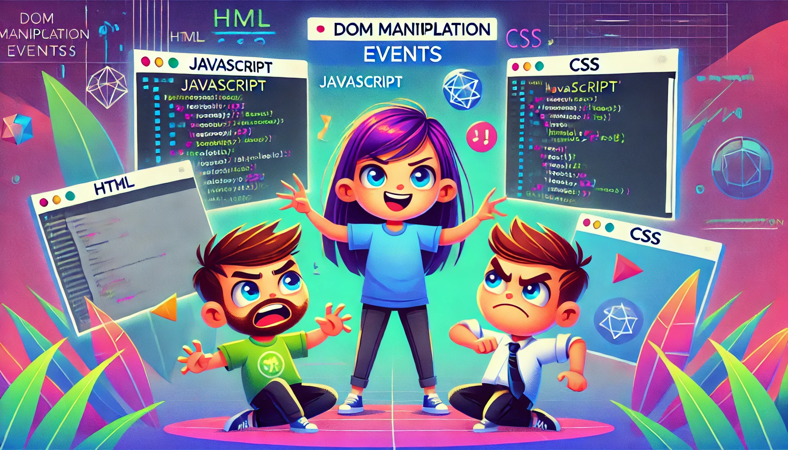

# DOM Events

## DOM

- DOM (Document Object Model) represents the structure of an HTML or XML document as a tree of objects. Each element, attribute, and text node in the document is a node in this tree.
- The DOM tree consists of a hierarchy where the document is the root node, and all elements are its children.
- Events in the DOM allow interaction with elements. Examples include click, mouseover, keydown, etc. Event listeners can be attached to nodes to handle these interactions.
  > DOM tree
  > 

## Events :-

### What are Events? :-

- Events are triggered by the browser when something happens, like a user clicking a button or pressing a key.
- JavaScript can be used to listen to and handle these events with event listeners.

### Why Events? :-

- Using events our mouse or keyboard or touch can work, otherwise phones, laptops and all other things are useless.
- All done by Events. may be the events from browser or operating system
  1. The Browser – Handling user interactions in web applications, like click, keydown, or touchstart.
  2. The Operating System (OS) – Managing hardware-level events, such as file system changes, device connections, or system notifications.

> We will learn only Browser events in this article.

### How to use Events ? :-

> Before using events, we have to know type of events.

1. Mouse Events
2. Keyboard Events
3. Touch Events
4. Form Events
5. Clipboard Events
6. Drag & Drop Events
7. Animation & Transition Events
8. Window/Document Events
9. Media Events

> ### We only see about mouse events and keyboard events in the article.

#### 1. Mouse Events :-

- Mouse events are events that occur when the user interacts with the mouse on the page.
- Common mouse events include click, mouseover, mouseout, and mousemove.
- Let us understand one by one with some analogys.

  ##### 1. `click` :-

  - When the user clicks on an element, the click event is triggered.
  - Let's understand with an analogy.
  - When you sign in or sign up in facebook, If you use laptop or desktop, you have to click on the sign in or sign up button.
    

  code(syntax) :-

  ```javascript
  document.querySelector("button").addEventListener("click", () => {
    console.log("button clicked");
  });
  ```

  ##### 2. `dblclick` :-

  - When the user double-clicks on an element, the dblclick event is triggered.
  - Let us understand with an analogy
  - When we click twice immediately on a folder, It opens up, same as files
    
    code(syntax) :-

    ```javascript
    document.querySelector(".folder").addEventListener("dblclick", () => {
      console.log("folder opened");
    });
    ```

  ##### 3. `mousedown` :-

  - When the user holds down the mouse button on an element, the mousedown event is triggered.
  - Let us understand with an analogy

    - Dragging an Element
      - Example: Clicking and holding an object to move it around.
    - Drawing on a Canvas
      - Example: Starting to draw on a whiteboard when the mouse button is pressed.
    - Select some text
      - Example: When You select some text by click on mouse and without releve it drag for copy or cut

    
    code(syntax) :-

    ```javascript
    document.querySelector(".text").addEventListener("mousedown", () => {
      console.log("select the text");
    });
    ```

  ##### 4. `mouseup` :-

  - When the user release the mouse button after mousedown on an element, the mouseup event is triggered.
  - Example:-
    - After selecting all, we have to release the mouse button, when we release the mouse button, we called it mouseup event

  code(syntax) :-

  ```javascript
  document.querySelector(".text").addEventListener("mouseup", () => {
    console.log("Your text is selected");
  });
  ```

  ##### 5. `mousemove` :-

  - We move our mouse from left to right or vice-versa or left to right or vice-versa, then the cursor moves accroding to our mouse moves, that is the real life example of mousemove event.

  code(syntax) :-

  ```javascript
  document.querySelector(".text").addEventListener("mousemove", () => {
    console.log("Mouse is moving");
  });
  ```

#### 2. Keyboard Events :-

- There are three types of keyboard events.

  - keydown
  - keyup
  - keypress (deprecated)

  ##### 1. `keydown` :-

  - When we press any key then keydown event triggered.
  - Example:- When we press any key like 'a', '1', '#' how do they show on screen.
  - They are example of keydown.

  code :-

  ```javascript
  document.addEventListener("keydown", function (event) {
    console.log(`You pressed ${event.key}`);
  });
  ```

  - When you pressed any key It will show like 'You pressed c' in console.

  ##### 2. `keyup` :-

  - When we release the finger from the key then the keyup event fired.

  code :-

  ```html
  <input type="text" id="typeInput" placeholder="Start typing..." />
  <p id="typedText"></p>

  <script>
    let typeInput = document.getElementById("typeInput");
    let typedText = document.getElementById("typedText");

    typeInput.addEventListener("keyup", function () {
      typedText.innerText = typeInput.value;
    });
  </script>
  ```

  - Spin up your vs code copy the code and paste after create an html file.
  - Run the code using go live. In browser you can see a input field, when you click on any key, It will not show on the browser window, when you release the key from the key you can see the key show on browser window.
