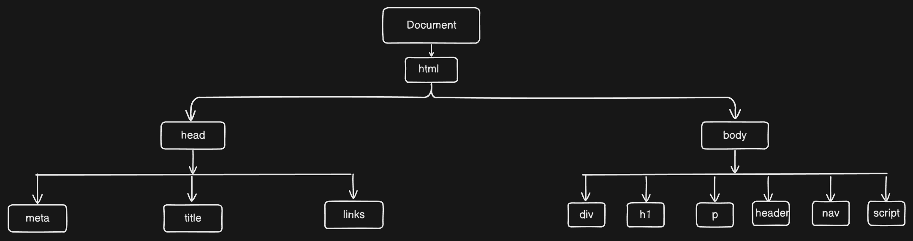

# DOM Events

## DOM

- DOM (Document Object Model) represents the structure of an HTML or XML document as a tree of objects. Each element, attribute, and text node in the document is a node in this tree.
- The DOM tree consists of a hierarchy where the document is the root node, and all elements are its children.
- Events in the DOM allow interaction with elements. Examples include click, mouseover, keydown, etc. Event listeners can be attached to nodes to handle these interactions.
  > DOM tree
  > 

## Events :-

### What are Events? :-

- Events are triggered by the browser when something happens, like a user clicking a button or pressing a key.
- JavaScript can be used to listen to and handle these events with event listeners.

### Why Events? :-

- Using events our mouse or keyboard or touch can work, otherwise phones, laptops and all other things are useless.
- All done by Events. may be the events from browser or operating system
  1. The Browser – Handling user interactions in web applications, like click, keydown, or touchstart.
  2. The Operating System (OS) – Managing hardware-level events, such as file system changes, device connections, or system notifications.

> We will learn only Browser events in this article.

### How to use Events ? :-

> Before using events, we have to know type of events.

1. Mouse Events
2. Keyboard Events
3. Touch Events
4. Form Events
5. Clipboard Events
6. Drag & Drop Events
7. Animation & Transition Events
8. Window/Document Events
9. Media Events
