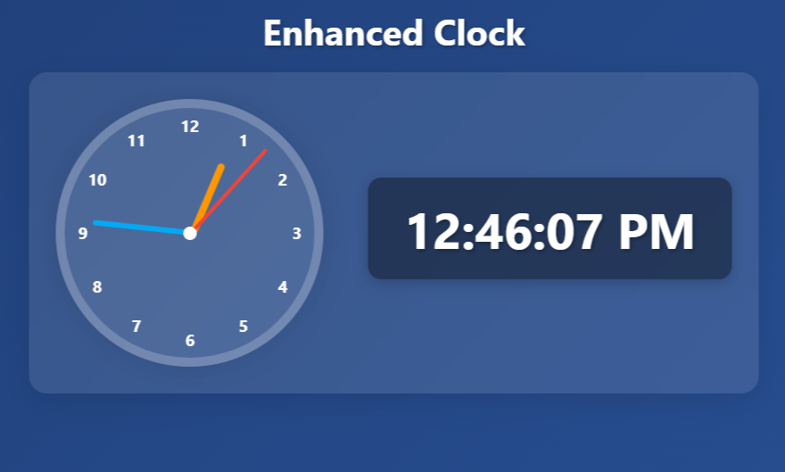

# What I learn when doing this assignment

## setInterval :-

- It runs taking some gap in time.
- It takes parameters a cb function and a time in milliseconds.

> Syntax :- `setInterval(() => {}, 4*1000)`

- Here first in the anonomyus call back function and time frame is 4 seconds.(4000 milliseconds)

- But in this case we pass the referrence of the displayTime function between the setInterval.
  > If I do this `setInterval(displayTime(), 1000)` :-
- It directly executed the function, time can not running, when we refresh the code then the actual time show when javascript engine run the code.

> If I do this `setInterval(() => displayTime, 1000)`

- The code never run because setInterval expects a function that runs repeatedly, but in this case, it’s just returning displayTime without calling it.

> If I do this `setInterval(() => displayTime(), 1000)`

- The code runs but before running It takes 1 sec time interval, so we can clearly see that the clock loads in browser with time 00:00:00, takes 1 sec gap then the actual time comes.

> So the correct code is

```javascript
setInterval(displayTime, 1000);
displayTime();
```

## Clock Hand Calculation :-

```javascript
let hourRotation = (hours % 12) * 30 + mins * 0.5;
let minRotation = mins * 6;
let secRotation = secs * 6;
```

- I had no knowledge of this type of mathematical knowledge in coding..

### hourRotation :-

- After this project I learn the degrees calculator, I knew 1 hour is taking 30 degrees because total 12 hours and 12 gaps between the numbers.

- 1 circle degree value is 360 degree. divide by 12 is equal to 30 degrees, when 1 hour complete it takes 30 degrees to cover.

- per minute the hour hand need to move 0.5 degree. divide by 60 is equal to 0.5 degree, when 1 minute complete it takes 0.5 degrees to cover.

### minRotation :-

- After this project I learn the degrees calculator, I knew 1 minute is taking 6 degrees because total 60 minutes and 60 gaps between the numbers.

- 1 circle degree value is 360 degree. divide by 60 is equal to 6 degrees, when 1 minute complete it takes 6 degrees to cover.

- per second the minute hand need to move 6 degree. divide by 60 is equal to 6 degree, when 1 second complete it takes 6 degrees to cover.

### secRotation :-

- After this project I learn the degrees calculator, I knew 1 second is taking 6 degrees because total 60 seconds and 60 gaps between the numbers.

- 1 circle degree value is 360 degree. divide by 60 is equal to 6 degrees, when 1 second complete it takes 6 degrees to cover.
